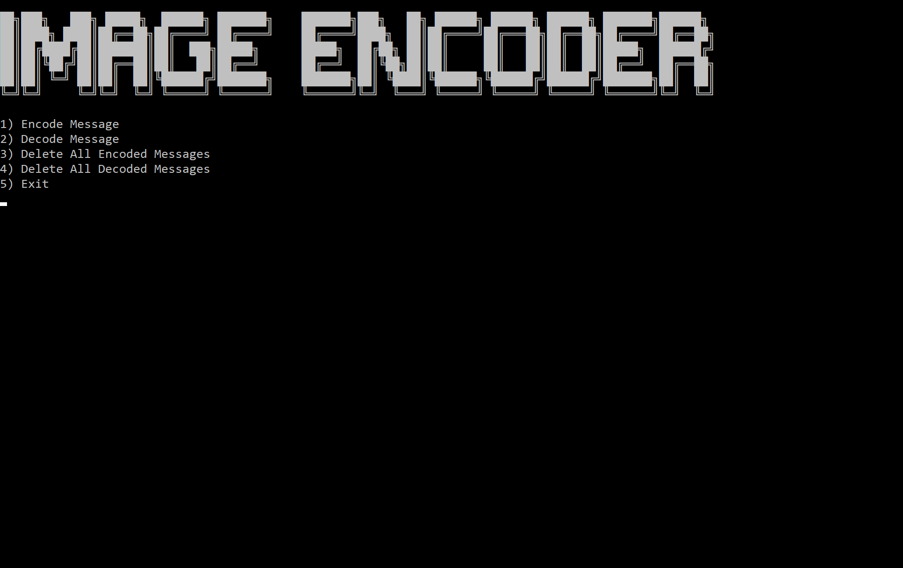
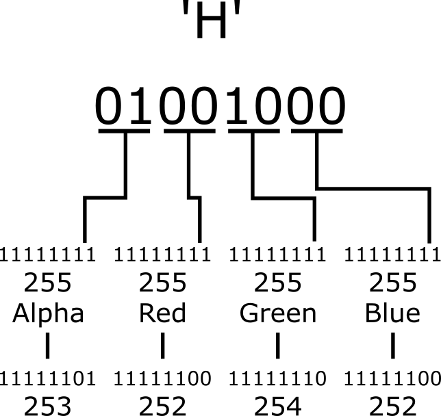

# imgXcoder
imgXcoder is a console application written in Java that allows
a user to encode a secret message into an image that can be exported
and sent to friends. The user is also able to import images that have
been sent to them by friends to decode.

#### Tables of Content
[How it works](#how-it-works)  
[Motivation](#motivation)   
[Challenges](#challenges)   
[What I would change](#what-i-would-change)   
[How to install, setup, and run](#how-to-install-set-up-and-run) 

## How it works
### *Interaction*
The way the user interacts with this application is through the command line. Usually, several options are displayed, and the user types a number corresponding to one of the options to select it.

The other way the user interacts with this application is through their file explorer. Image files wanting to be encoded or decoded can be dragged into appropriate directories and read by the application.

### *The algorithm*
The big secret to the algorithm that encodes and decodes image files is what it does to their RGBA values.

Take, for example, the case of encoding, the user is prompted to input a message to encode into a previously selected image file. Each one of the characters of the message is read, and the bits of the binary representation of its Ascii value are stored into the two least significant bits of the RED, GREEN, BLUE, and ALPHA color channels at a given pixel of an image. 

After a character's bits have been encoded into the RGBA values at a given pixel, it moves to the next pixel in the image. The process is repeated with the next chataracter until the end of the message is reached.

## Motivation
My motivation for this project was to create something 
my friend and I could use to secretly communicate in our 
Discord server to mess with our other friends while we play 
games.

## Challenges
My biggest challenge while developing this project was avoiding
string concatenation in loops. In my original implementation,
I was converting RGBA values into strings to manipulate using 
Java's *toBinaryString* method. However, I was not satisfied 
with this approach and instead opted to manipulate the bits of
the RGBA values using *Bitwise Operations*. This avoided all
unnecessary string concatenation in both my *ImageEncoder* class
and my *ImageDecoder* class.

## What I would change
The main thing I would change about this project is
its lack of Discord integration, as that was the key
motivation behind its creation. It would be nice
to be able to encode and decode messages directly from
Discord using the app as the GUI instead of the console. 
This change would also open up the possibility of this 
application's use on mobile devices via the Discord App.

## How to install, setup, and run
To use imgXcoder, first, you must clone imgXcoder.jar and
LAUNCHER.bat to a directory on your machine. 

After this, you may now double-click on the 
LAUNCHER.bat file, in the directory your placed it, to
launch the application.

In the folder containing the .jar and .bat files you just 
cloned, you will notice that three directories have been 
created:

* *imagesToEncode* - the directory to place image files you
        would like to encode a message in.
* *imagesEncoded* - the directory image files are placed 
        in after they are encoded.
* *imagesToDecode* - the directory to place image files you
        want to decode a message from.

NOTE: If you accidentally delete a directory, 
it will be recreated next time the application is run.

Happy encoding!